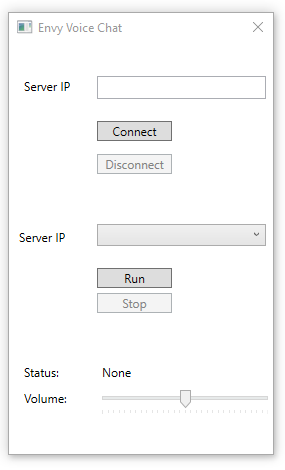

# Audio Chat

Simple audio chat for two users. Written in C# using WPF and NAudio library. Working only in local network.

- Connect -> to connect to existing server
- Run -> to run server
- Volume -> to adjust volume
